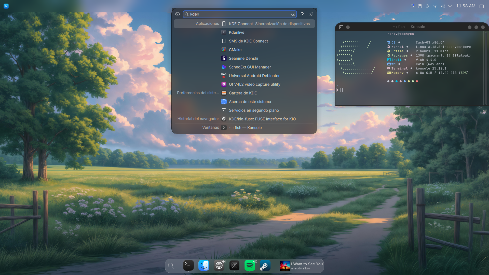
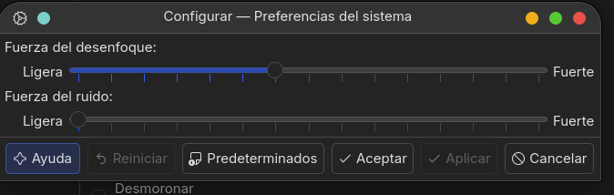
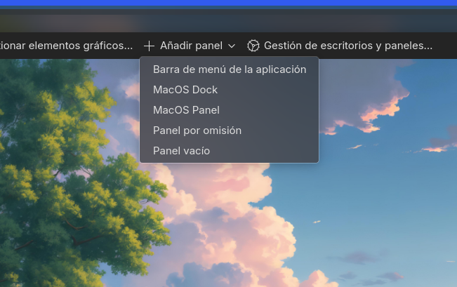
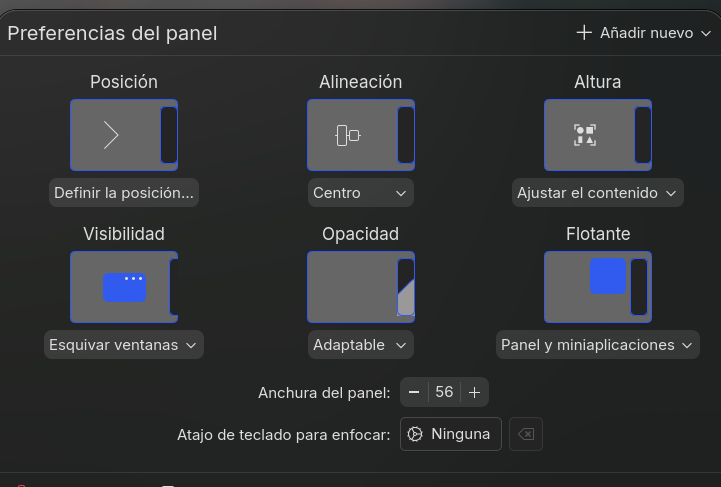
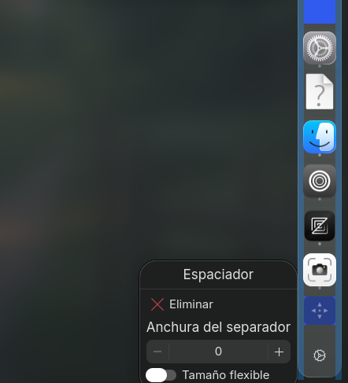
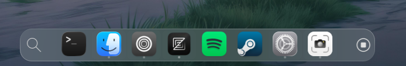

# 🍎 **macOS Transformation para KDE Plasma 6**

<div align="center">
  
  <br>
  
  
  
  

</div>

Este repositorio contiene la configuración y los pasos necesarios para recrear un entorno estético basado en el ecosistema de ```macOS Tahoe``` utilizando **KDE Plasma 6**.

Link del Wallpaper: https://www.xtrafondos.com/wallpaper/8192x4560/13431-paisaje-anime-del-campo.html

---

## 🛠 **Requisitos previos**

Antes de comenzar, asegúrate de tener instaladas las dependencias necesarias para compilar y mover los archivos de los temas.

**En Arch Linux / CachyOS / Manjaro:**
```bash
sudo pacman -S git base-devel
```

**En Debian / Ubuntu / Linux Mint:**
```bash
sudo apt install git 
```

---

## 🚀 **Instalación**

Sigue este orden lógico para evitar errores de dependencias de iconos o esquemas de color.

### 1. Tema Global (MacTahoe KDE)
Este paquete incluye el estilo de las ventanas (Aurorae), el esquema de colores y el tema de Plasma.

```bash
# Clonar el repositorio
git clone https://github.com/vinceliuice/MacTahoe-kde.git

# Acceder al directorio
cd MacTahoe-kde

# Dar permisos y ejecutar
chmod +x install.sh
./install.sh
```

### 2. Paquete de Iconos
Es recomendable instalar los iconos por separado para asegurar que todas las variantes (Light/Dark) estén disponibles.

```bash
# Clonar el repositorio de iconos
git clone https://github.com/vinceliuice/MacTahoe-icon-theme.git

# Acceder al directorio
cd MacTahoe-icon-theme

# Dar permisos y ejecutar
chmod +x install.sh
./install.sh
```

---

## ⚙️ **Configuración del Sistema**

Una vez instalados los archivos, aplica los cambios desde la interfaz de KDE:

### 🎨 Apariencia Visual
1. Ve a **Preferencias del Sistema > Aspecto**.
2. **Tema Global**: Selecciona `MacTahoe-Dark`. 
   > *Opcional: Marca "Diseño de escritorio" si deseas que los paneles se reorganicen automáticamente.*
3. **Iconos**: Selecciona `MacTahoe-Dark` (o la variante de tu gusto).

### 💧 Efectos y Transparencias

**1. Efecto Blur (Desenfocar)**
*Ruta: Preferencias del Sistema > Gestión de ventanas > Efectos del escritorio > Desenfocar.*
Habilítalo y ajusta la configuración (ícono de engranaje) así:

<div align="center">
  
</div>

<br>

**2. Transparencia en menús contextuales**
*Ruta: Preferencias del Sistema > Colores y Temas > Estilo de las aplicaciones.*
En el tema seleccionado, haz clic en **Editar (lápiz)** y ajusta la transparencia:

<div align="center">
  
</div>

> **⚠️ Importante:** Recuerda hacer clic en **"Aplicar"** en cada paso.

---

## 🖥️ **Panel y Dock**

Haz clic derecho en el escritorio > **Entrar en modo de edición** > **Añadir panel**.

<div align="center">
  
</div>

1. **Eliminar paneles viejos:** Selecciona tus paneles actuales y usa la opción `Borrar panel`.
2. **Panel Superior:** Selecciona `macOS Panel` y ubícalo arriba.
3. **Dock Inferior:** Selecciona `macOS Dock` y ubícalo abajo.

---

## 🔧 **Personalización del Dock**

- Aplica las mismas configuraciones de la imagen:

<div align="center">
  
</div>

### Separadores
Clic derecho en el dock > **Mostrar configuración del panel**.

1. Usa el botón `Añadir nuevo` y agrega un **Separador** (dos veces).
2. Pasa el cursor sobre los separadores (franjas azules) y **desactiva** la opción `Tamaño flexible`.
   
<div align="center">
  
</div>

3. Ajusta la anchura a gusto (Ej: 10 izquierda, 20 derecha).

### Elementos gráficos (Widgets)
1. Usa el botón `Añadir nuevo` (o clic derecho en el dock) > `Añadir elementos gráficos`.
2. Busca y añade:
   - **Buscar** (Buscar y lanzar)
   - **Reproductor multimedia**
3. Arrastra los elementos manteniendo presionado el clic izquierdo para ordenarlos.

<div align="center">
  <h3>✨ Resultado Final del Dock</h3>
  
</div>

---

¡Espero que este tutorial te haya servido!
